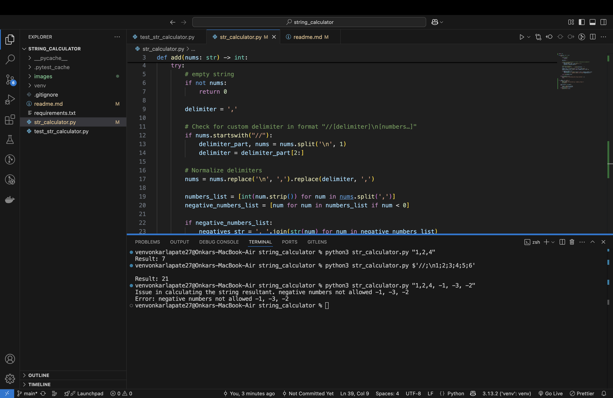
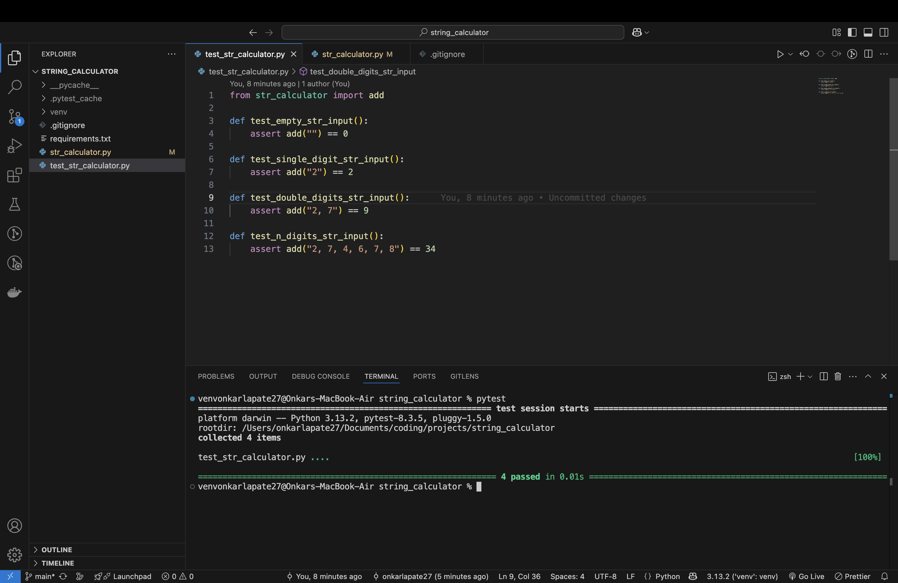
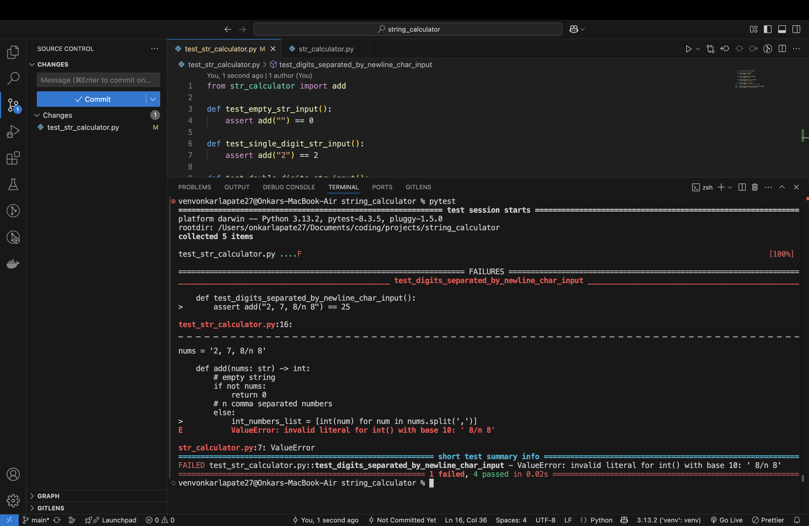
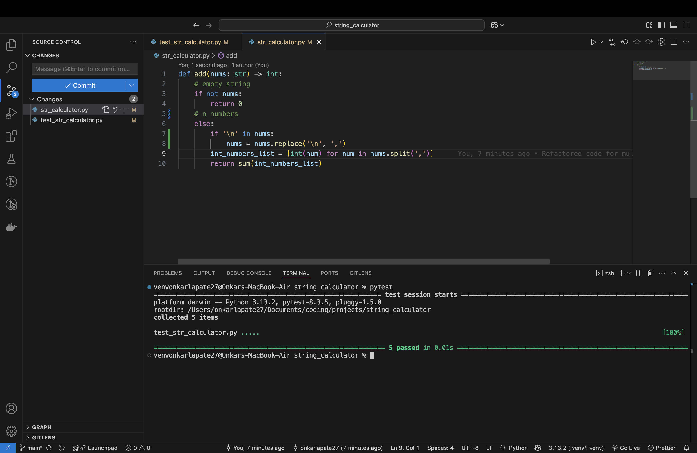
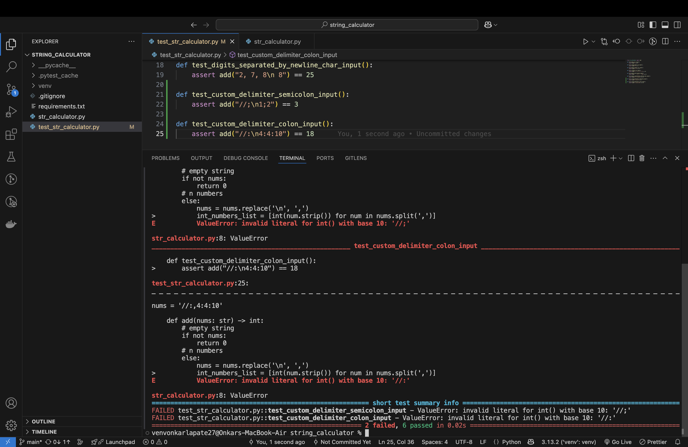

# String Calculator (TDD)

A simple Python project demonstrating the **Test-Driven Development (TDD)** technique with a **String Calculator** that adds numbers in a string format, supporting custom delimiters and negative number validation.

## Features

- Handles empty string input.
- Supports default delimiters: `,` and `\n`.
- Supports custom delimiters in the format: `//[delimiter]\n[numbers]`.
- Raises an exception for negative numbers with details of offending numbers.
- Ignores whitespace around numbers.

## Tech Stack

- **Language:** Python 3.x
- **Testing Framework:** pytest

## Installation

### 1. Clone the repository:
   ```bash
   git clone https://github.com/onkarlapate27/string_calculator.git
   ```

### 2. Create Virtual Environment & Install Dependencies

```bash
python3 -m venv venv
source venv/bin/activate
pip install -r requirements.txt
```

## Testing

```bash
pytest
```

## Code output


## Code Development Steps Screenshots

---

---

---

